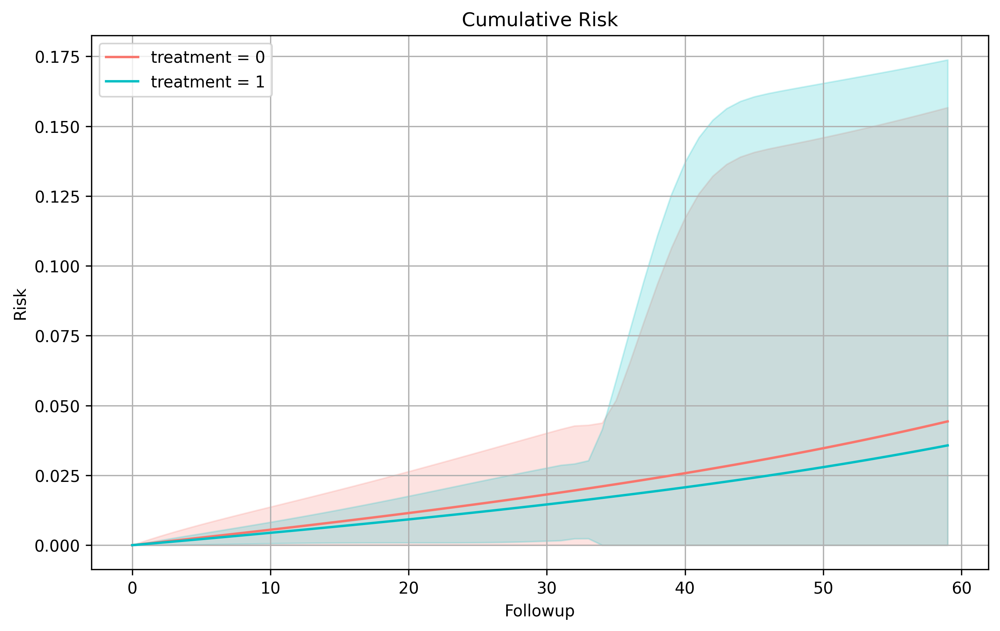

# Exploring Results

Recall our previous example, {doc}`More Advanced Analysis <more_advanced_models>`, where we finalized and collected our results with 

```python
my_output = my_analysis.collect()
my_output.to_md()
```
Let us now go over what the dump to md looks like and explore our output in further detail.

## SEQuential Analysis: {date}: censoring

## Weighting

We begin by exploring the weight models, this gives us general information about the numerator and denominator models, as well as weight statistics before applying any limits. If you recall, we imposed weight bounds at the 99th percentile. This means that in the outcome model our weights will be bound at [0.273721, 423.185]. Note that in real analysis, we would hope the weights are stabilized further. Using the generated data, specifically with excused analysis, often result in larger-than-intended weights.

We should also note here that in excused-censoring analysis, our adherance models hold `switch` as the dependent variable. In all non-excused cases, this would normally be your treatment value.

### Numerator Model

```
                          MNLogit Regression Results                          
==============================================================================
Dep. Variable:                 switch   No. Observations:                65375
Model:                        MNLogit   Df Residuals:                    65366
Method:                           MLE   Df Model:                            8
Date:                Wed, 10 Dec 2025   Pseudo R-squ.:                0.008332
Time:                        10:18:38   Log-Likelihood:                -13986.
converged:                       True   LL-Null:                       -14103.
Covariance Type:            nonrobust   LLR p-value:                 2.560e-46
===============================================================================
   switch=1       coef    std err          z      P>|z|      [0.025      0.975]
-------------------------------------------------------------------------------
Intercept      -0.8797      0.692     -1.271      0.204      -2.236       0.477
sex[T.1]       -0.0461      0.035     -1.325      0.185      -0.114       0.022
N_bas           0.0026      0.003      0.741      0.459      -0.004       0.009
L_bas           0.3368      0.032     10.553      0.000       0.274       0.399
P_bas          -0.1864      0.073     -2.556      0.011      -0.329      -0.043
followup       -0.0211      0.006     -3.822      0.000      -0.032      -0.010
followup_sq     0.0001      0.000      0.637      0.524      -0.000       0.000
trial          -0.0624      0.014     -4.430      0.000      -0.090      -0.035
trial_sq        0.0004      0.000      2.309      0.021    5.78e-05       0.001
===============================================================================
```

### Denominator Model

```
                          MNLogit Regression Results                          
==============================================================================
Dep. Variable:                 switch   No. Observations:                65375
Model:                        MNLogit   Df Residuals:                    65363
Method:                           MLE   Df Model:                           11
Date:                Wed, 10 Dec 2025   Pseudo R-squ.:                 0.01586
Time:                        10:18:38   Log-Likelihood:                -13880.
converged:                       True   LL-Null:                       -14103.
Covariance Type:            nonrobust   LLR p-value:                 5.374e-89
===============================================================================
   switch=1       coef    std err          z      P>|z|      [0.025      0.975]
-------------------------------------------------------------------------------
Intercept      -1.4384      0.715     -2.012      0.044      -2.840      -0.037
sex[T.1]       -0.0447      0.035     -1.281      0.200      -0.113       0.024
N              -0.0195      0.003     -5.655      0.000      -0.026      -0.013
L               0.3719      0.062      6.025      0.000       0.251       0.493
P               0.9362      0.139      6.723      0.000       0.663       1.209
N_bas           0.0023      0.003      0.674      0.501      -0.004       0.009
L_bas          -0.1703      0.092     -1.842      0.066      -0.351       0.011
P_bas          -0.9966      0.139     -7.166      0.000      -1.269      -0.724
followup        0.0906      0.022      4.164      0.000       0.048       0.133
followup_sq    -0.0007      0.000     -3.678      0.000      -0.001      -0.000
trial          -0.0695      0.014     -4.934      0.000      -0.097      -0.042
trial_sq        0.0006      0.000      3.788      0.000       0.000       0.001
===============================================================================
```

### Weighting Statistics

|   weight_min |   weight_max |   weight_mean |   weight_std |   weight_p01 |   weight_p25 |   weight_p50 |   weight_p75 |   weight_p99 |
|-------------:|-------------:|--------------:|-------------:|-------------:|-------------:|-------------:|-------------:|-------------:|
|  3.11308e-08 |  9.08003e+30 |   1.97762e+26 |  3.39822e+28 |     0.260691 |     0.853367 |      1.02192 |      1.28444 |        30119 |

## Outcome

After weight information, we begin to gather information about the outcome model itself. This comes from the `fit` whereas survival information (or risk/incidence depending on your specifications) comes from `survival`.

### Outcome Model

```
                 Generalized Linear Model Regression Results                  
==============================================================================
Dep. Variable:                outcome   No. Observations:               658971
Model:                            GLM   Df Residuals:                   658961
Model Family:                Binomial   Df Model:                            9
Link Function:                  Logit   Scale:                          1.0000
Method:                          IRLS   Log-Likelihood:                -2844.7
Date:                Wed, 10 Dec 2025   Deviance:                       5689.4
Time:                        10:18:38   Pearson chi2:                 6.80e+05
No. Iterations:                    11   Pseudo R-squ. (CS):          0.0001638
Covariance Type:            nonrobust                                         
====================================================================================
                       coef    std err          z      P>|z|      [0.025      0.975]
------------------------------------------------------------------------------------
Intercept          -23.1102      2.697     -8.569      0.000     -28.396     -17.824
tx_init_bas[T.1]    -0.2221      0.185     -1.203      0.229      -0.584       0.140
sex[T.1]            -0.5588      0.113     -4.942      0.000      -0.780      -0.337
followup             0.0060      0.015      0.416      0.678      -0.022       0.035
followup_sq          0.0001      0.000      0.465      0.642      -0.000       0.001
trial                0.3377      0.054      6.274      0.000       0.232       0.443
trial_sq            -0.0022      0.001     -4.223      0.000      -0.003      -0.001
N_bas               -0.0007      0.011     -0.066      0.947      -0.022       0.021
L_bas               -0.3595      0.072     -4.962      0.000      -0.501      -0.217
P_bas                1.6141      0.281      5.752      0.000       1.064       2.164
====================================================================================
```

### Survival

If we enable `km_curves` in our options, we can extract risk information between treatment values. These will be returned in the table below. Additionally, plots you create will be stored here.

To note, you can see here we have a risk plot. If you would like a different plot, you can simply specify another plot to be made when calling the class method {py:meth}`~pySEQTarget.SEQuential.plot`. This can be done on any `SEQuential` class object, or when collecting, you can also access the data used to create these plots with

```python
survival_data = my_output.retrieve_data("km_data")
```

#### Risk Differences

|   A_x |   A_y |   Risk Difference |   RD 95% LCI |   RD 95% UCI |
|------:|------:|------------------:|-------------:|-------------:|
|     0 |     1 |        0.00859802 |    -0.169438 |     0.186634 |
|     1 |     0 |       -0.00859802 |    -0.186634 |     0.169438 |

#### Risk Ratios

|   A_x |   A_y |   Risk Ratio |   RR 95% LCI |   RR 95% UCI |
|------:|------:|-------------:|-------------:|-------------:|
|     0 |     1 |     1.24069  |   0.0121904  |      126.272 |
|     1 |     0 |     0.806005 |   0.00791939 |       82.032 |

#### Survival Curves



## Diagnostic Tables

After all of our primary results, we are met with a few diagnostic tables. These contain useful information to the expanded dataset. Tables with the title 'unique' indicates that one ID can attribute once to the count, e.g. ID A101 in the expanded framework has an outcome in Trial 1, and 2 while on treatment regime = 1. In the unique case, they would only attribute to one count, in the non-unique case, both trials would be included.

Because we have an excused-censoring analysis, we are also provided with information about switches from treatment as well as how many of these switches were excused.

### Unique Outcomes

|   tx_init |   outcome |   len |
|----------:|----------:|------:|
|         0 |         0 |   249 |
|         1 |         1 |     8 |
|         0 |         1 |     4 |
|         1 |         0 |   715 |

### Nonunique Outcomes

|   tx_init |   outcome |    len |
|----------:|----------:|-------:|
|         0 |         1 |     73 |
|         1 |         0 | 546644 |
|         1 |         1 |    227 |
|         0 |         0 | 117007 |

### Unique Switches

|   tx_init | isExcused   |   switch |   len |
|----------:|:------------|---------:|------:|
|         0 | True        |        1 |    30 |
|         1 | False       |        1 |    47 |
|         0 | False       |        1 |    91 |
|         1 | True        |        1 |    32 |
|         0 | False       |        0 |   132 |
|         1 | False       |        0 |   644 |

### Nonunique Switches

|   tx_init | isExcused   |   switch |    len |
|----------:|:------------|---------:|-------:|
|         0 | True        |        0 |  22056 |
|         0 | False       |        1 |   3724 |
|         1 | False       |        1 |   1256 |
|         1 | False       |        0 | 527107 |
|         1 | True        |        0 |  18508 |
|         0 | False       |        0 |  91300 |
